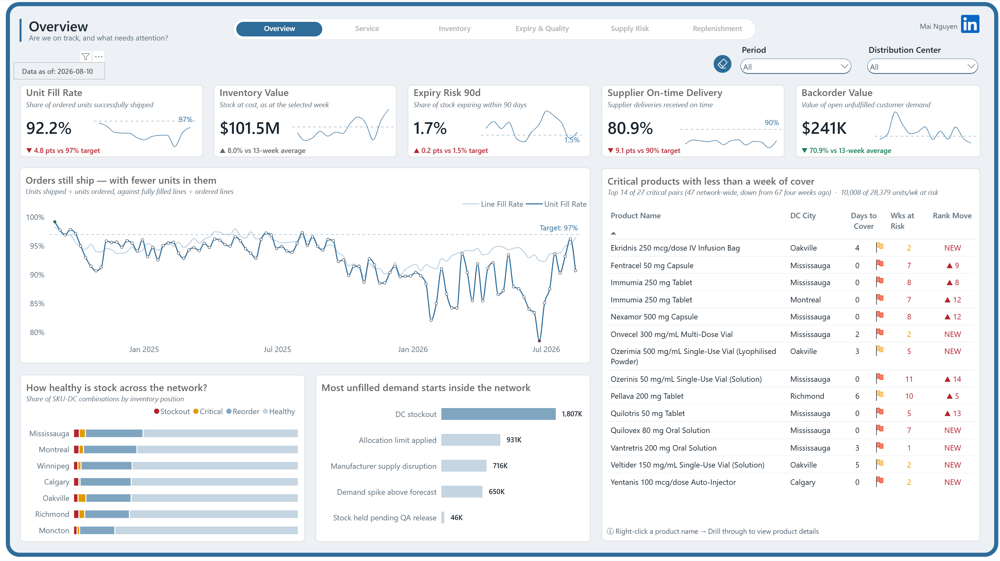
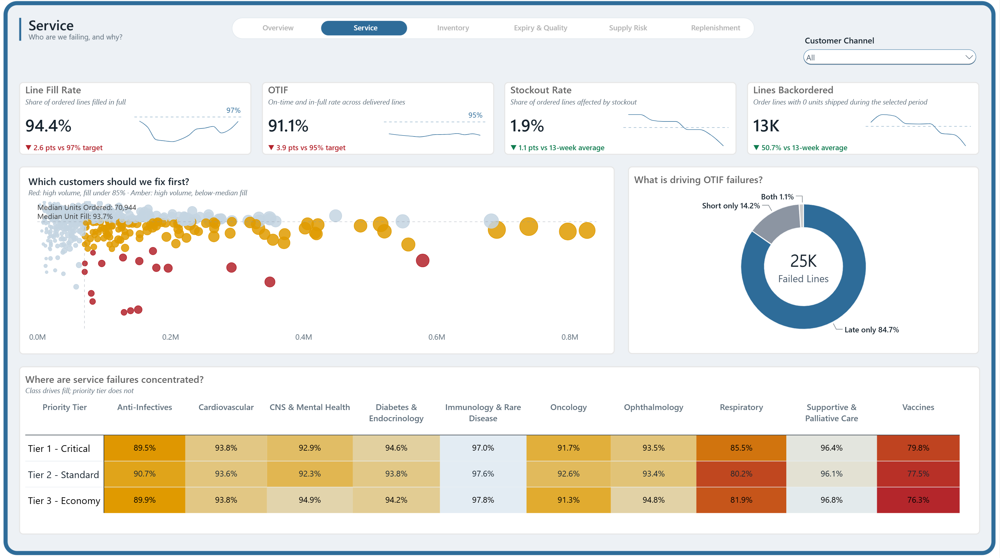
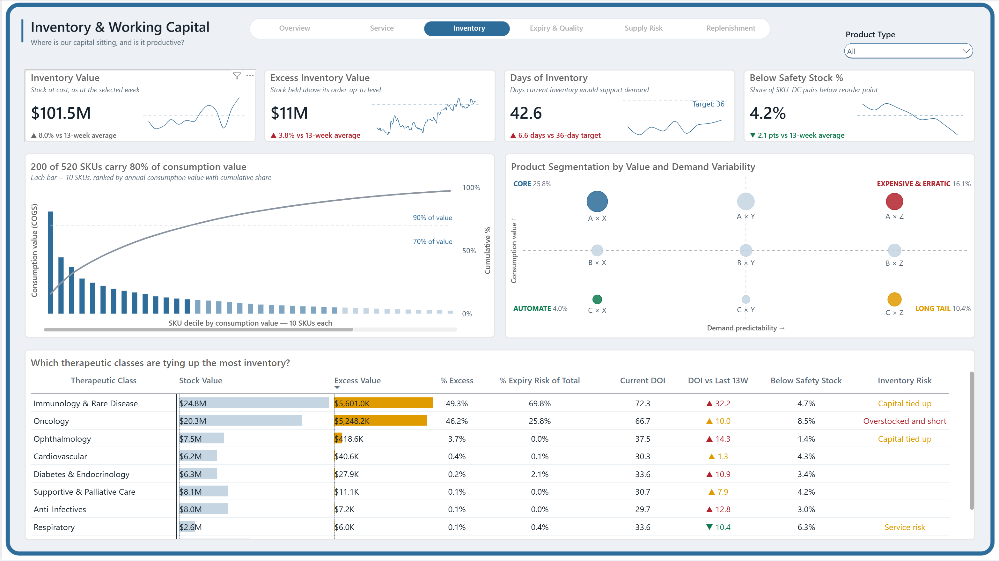
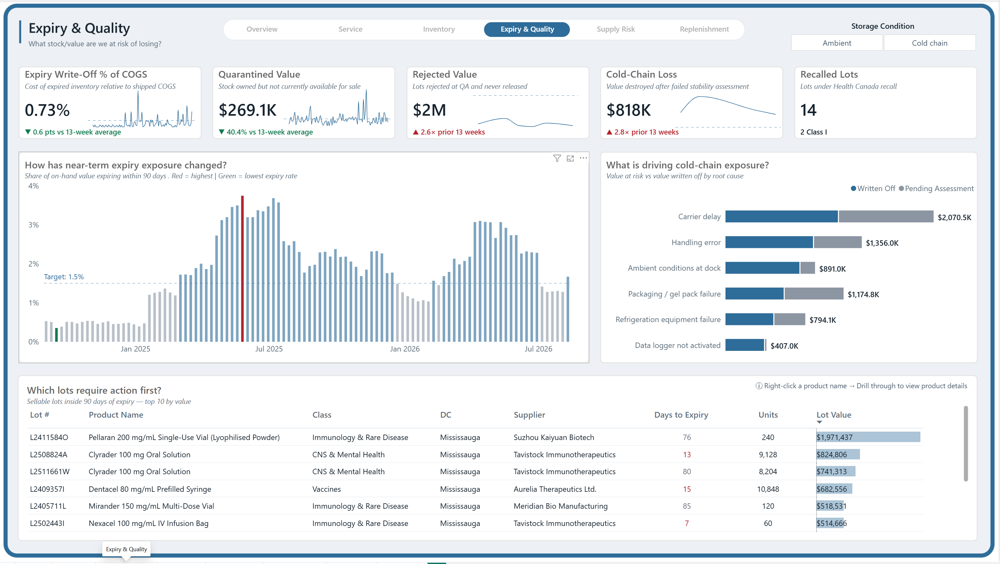
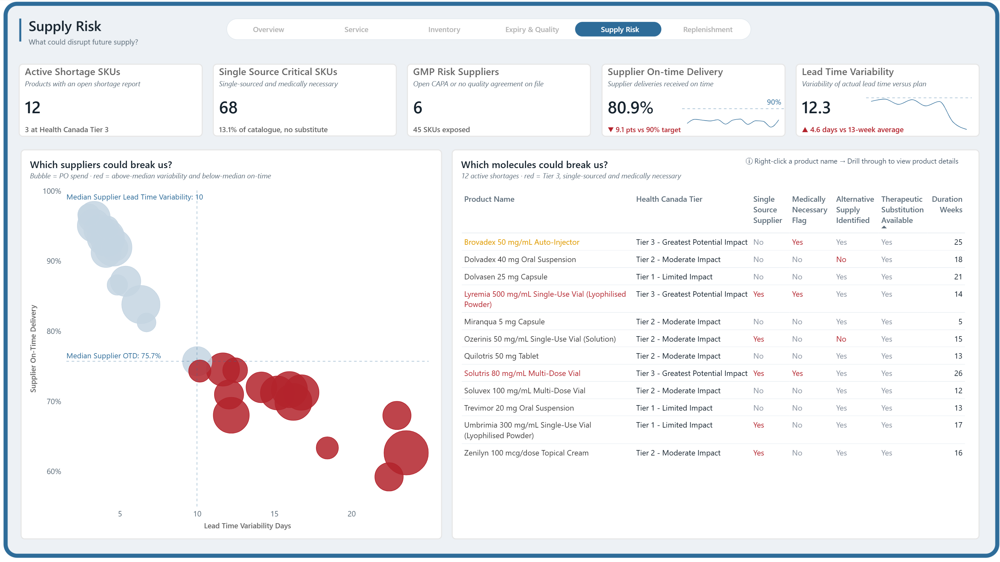
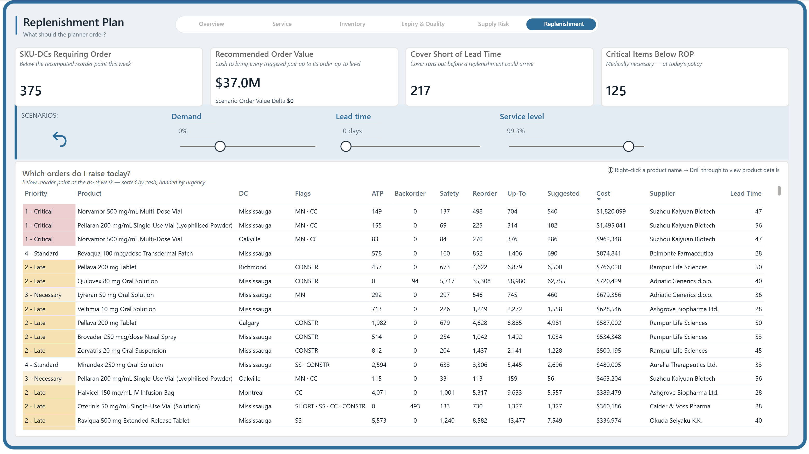
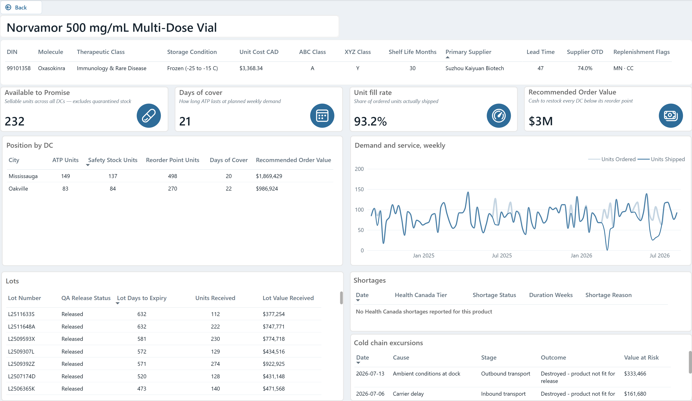

# Pharmaceutical Inventory & Supply Risk Intelligence
### From service gaps to replenishment decisions

**[View interactive dashboard in Power BI](https://app.powerbi.com/groups/943b04fa-a797-4393-9714-4b50535e1d78/reports/b8cffddc-a52c-4ea8-bc2c-a54ef729bb05/5b020d87de3741fdbfa9?experience=power-bi)**

*Power BI sign-in and permission to view the report may be required.*

**How can a business hold $101.5 million in inventory and still struggle to give customers what they ordered?**

This dashboard was built to investigate that question for a simulated pharmaceutical distributor. It connects customer service, stock investment, expiry exposure, and supplier performance, then turns those findings into priorities for the inventory planner.

> **The management flow:** Overview signals where performance is off track → analytical pages investigate the problem → Replenishment identifies what the planner should review and order → Product Detail supports individual decisions.

## Business problem

Having stock in the warehouse does not necessarily mean having the right products, in the right locations, when customers need them.

For a pharmaceutical distributor, this creates a difficult balance. Too little available stock can leave customer orders incomplete. Too much of the wrong stock ties up cash and may expire before it is used. Delivery delays and quality holds can make both problems harder to manage.

The business needs to answer three questions:

- **Where are customer expectations not being met?**
- **Where is inventory investment creating exposure rather than supporting service?**
- **What should the team act on first?**

The dashboard was designed to give managers a clear view of the situation and planners a practical starting point for action.

## Dataset: a realistic business case

The project follows **Maple Care Health Solutions**, a fictional Canadian pharmaceutical distributor serving customers through seven distribution centres, including Mississauga and Oakville.

The case covers approximately two years of activity, from September 2024 to August 2026. It brings together customer orders, stock positions, supplier deliveries, product expiry, and quality events.

The dataset reflects the scale and variety of a distribution business:

| Business coverage | What the dataset includes |
|---|---|
| **Distribution network** | 520 products, 45 suppliers, seven distribution centres, and 860 customer delivery locations |
| **Customer demand** | 292,403 customer order lines—each representing a product requested on an order |
| **Stock availability** | 142,290 inventory records across 102 weekly snapshots |
| **Supplier purchasing** | 26,578 purchase order lines tracking products ordered from suppliers |
| **Product batches** | 27,605 lot receipts, with expiry dates and quality-release information |
| **Supply and quality events** | 264 shortage reports and 259 temperature-related incidents |

Together, these records were used to connect customer requests with stock availability, supplier performance, and product expiry or quality concerns.

**All business data is simulated.** The findings illustrate the analysis of this case, not the performance of a real company. All dollar amounts are Canadian dollars, and performance targets are assumptions set for the project.

**Inventory snapshots:** September 2, 2024–August 10, 2026. **Order dates:** September 2, 2024–August 14, 2026. Some receipt and event tables include pre-window history. The screenshot’s “Data as of” label refers to the latest inventory snapshot; it is not the maximum date in every table.

## Tools

**Microsoft Power BI** was used to prepare the information, build the dashboard, compare performance, and explore replenishment scenarios.

The focus of this presentation is how the dashboard was used to understand the business and support decisions.

## Analysis approach

The analysis was structured around the questions a manager would naturally ask:

1. **Check the overall health.** Compare service, stock investment, expiry exposure, and supplier delivery against expectations.
2. **Look beyond the headline.** Examine when performance changed, which customers were affected, and how orders failed.
3. **Locate the exposure.** Identify where excess stock and expiry risk were concentrated.
4. **Investigate supply constraints.** Consider delivery reliability and dependence on individual suppliers.
5. **Turn findings into action.** Test planning assumptions and identify products that need closer attention.

At each stage, observed findings were distinguished from issues requiring further investigation. A large number of problems at a large distribution centre, for example, does not automatically mean that centre performs worse.

## Main insights

- **Service problems were being understated by one measure alone.** Unit fill was **92.2%**, compared with **94.4%** of order lines filled completely. The gap widened during 2026, showing why both views mattered.
- **Most delivered-order failures involved timing.** **84.7%** of delivered order lines that failed the on-time-and-complete test were complete but late.
- **Excess inventory was concentrated.** Immunology & Rare Disease and Oncology accounted for **95.5% of the $11.36M in excess stock** and **95.7% of near-term expiry exposure**.
- **Supplier delays materially changed the purchasing requirement in the tested scenarios.** Adding 14 days to lead time increased the proposed order value by **$45.5M**, compared with **$20.8M** under a 25% demand increase.

These findings point toward targeted service investigation and stock rebalancing, rather than simply buying more or cutting inventory everywhere.

## Dashboard walkthrough

### 1. Overview — Is performance on track, and what needs attention?

**The tension between stock investment and customer service was examined first.**

The headline cards show **92.2% unit fill against a 97% target**, despite **$101.5M in inventory**. Expiry exposure is **1.7% against a 1.5% ceiling**, and supplier on-time delivery is **80.9% against a 90% target**. Open unfulfilled demand is valued at approximately **$241K**, below its recent average.

Together, these figures show why inventory value alone is not a measure of operational health.

**The small trend lines: which direction are the indicators moving?**

Each small line gives a quick sense of direction. The comparison beneath the number explains whether the current position is better or worse than its target or recent history. A lower backorder balance is encouraging, but it does not erase the service gap.

**The large service chart: when did the problem develop, and how long did it last?**

The share of requested units shipped was compared with the share of order lines filled completely, week by week.

An order line is one product entry on a customer's order. If a customer requests **1,000 units of one product and receives 950**, the unit fill rate is **95%**, but that line is still incomplete. One measure shows how much demand was served; the other shows whether each product request was fully satisfied.

The weekly chart reveals what a headline average hides: the two measures separated more sharply from **January 2026**, and their gap reached **10.1 percentage points in June**. Unit fill fell below 90% in **26 of the 102 weeks**. The narrowing gap later in the period suggests recovery, but the prolonged shortfall warrants investigation.

**The inventory-health chart: where is stock below the level needed?**

The proportion of product–location combinations needing attention was compared across locations, rather than relying on counts alone. Approximately **27.1%** were below their replenishment threshold.

This comparison changes the management discussion: a smaller location can need attention even when its absolute number of affected products looks modest.

**The unfilled-demand chart: what reasons were recorded?**

Local stock shortages were the largest recorded reason, accounting for approximately **1.81M unfilled units**. Allocation limits, manufacturer disruption, and demand above forecast also contributed.

This points the investigation toward both internal stock availability and external supply constraints. The recorded reasons are starting points for investigation, rather than proof of a single cause.

**The watchlist: which products need attention first?**

The watchlist combines limited cover with persistence: how long available stock could support demand, and how often the product has recently been at risk.

For example, **Ozerinis in Mississauga had no available cover and had been below one week's cover in 11 of the previous 12 weeks**. That deserves a different response from a product appearing on the list for the first time. Across the network, the count of low-cover product–location pairs had improved from **67 to 47** over four weeks.

**Next question:** We can see the service gap. Who is affected, and are orders failing because they are late, incomplete, or never shipped?

### 2. Service — Which customers are being underserved, and how?

**The customer experience was assessed through completeness, timing, and availability.**

The cards show **94.4% of order lines filled completely** and **91.1% of delivered lines arriving on time and complete**. Around **13K order lines shipped no units**, while **1.9% of ordered lines were affected by a stockout**.

This distinction matters: an order can be complete but late, partially supplied, or not supplied at all.

**The customer chart: where should service recovery start?**

Customer demand was compared with the share of requested units supplied. Amber identifies high-volume customers performing below the median fill rate, while red isolates high-volume customers with fill below 85%.

This creates a focused starting point for account reviews by separating broad underperformance from the most severe service gaps. Product and customer criticality should still guide the final priorities.

**The delivery-failure chart: is the main issue timing or quantity?**

Among delivered lines that failed the on-time-and-complete test:

- **84.7% were late but complete.**
- **14.2% were on time but incomplete.**
- **1.1% were both late and incomplete.**

Dispatch, transport, and delivery commitments should therefore be investigated alongside stock availability. The unshipped lines remain a separate service problem; they are not included in this delivered-order comparison.

**The service comparison by product group: where do shortfalls repeat?**

Performance was compared across customer priority tiers and product groups. **Vaccines and Respiratory products show weaker fill rates across all three tiers**. Vaccine fill ranges from approximately **76% to 80%**, while Respiratory ranges from **80% to 86%**.

The recurring pattern suggests a product-group investigation is needed, rather than assuming the issue is confined to one customer priority level.

**Next question:** If customers are still underserved, is the business holding too little inventory—or investing in the wrong mix?

### 3. Inventory & Working Capital — Is stock investment in the right place?

**Stock holdings were examined to determine whether they supported demand or tied up cash.**

The business held **$101.5M in inventory**, including **$11.36M above its planned upper stocking levels**. Inventory represented **42.6 days of activity against a 36-day target**, while **4.2% of product–location combinations were below their safety buffer**.

Excess stock and insufficient availability were present at the same time.

**The value-concentration chart: how broad is the important product range?**

Products were ranked by the cost value of goods supplied, and their cumulative share was examined. **200 of 520 products accounted for 80% of consumption value.**

The business cannot focus on only a very small group and assume the rest is unimportant. It needs close attention to the highest-value products and a manageable policy for the broader range.

**The product-segmentation chart: which products are expensive and difficult to predict?**

Product value was compared with demand consistency. The high-value, unpredictable group held **16.1% of inventory value**.

These products deserve more frequent review because purchasing too much can create substantial exposure, while purchasing too little can leave important orders incomplete. High-value products with steadier demand present a different planning challenge.

**The product-group table: where do excess and expiry exposure overlap?**

Immunology & Rare Disease and Oncology together accounted for **95.5% of excess stock** and **95.7% of near-term expiry exposure**.

Oncology made the imbalance particularly clear: approximately **25.9% of its stock value was excess**, while **8.5% of its product–location combinations were below their safety buffer**.

This supports a review of the product and location mix. It does not justify cutting stock uniformly across every product.

**Next question:** Where does excess inventory also have a deadline—and what other quality issues could make stock unusable?

### 4. Expiry & Quality — What value could be lost, and where is intervention needed?

**Stock at risk was distinguished from stock already lost.**

The cards show expiry write-offs equivalent to **0.73% of the cost of goods supplied**, approximately **$269K held in quarantine**, and **14 lots carrying simulated recall statuses**. The recent 13-week view also shows approximately **$2M rejected at quality assessment** and **$818K destroyed following temperature-related incidents**.

These are different management problems. Held stock may still be released; destroyed stock cannot be recovered.

**The weekly expiry chart: is exposure occasional or persistent?**

The value approaching expiry was compared with the project's 1.5% ceiling. Exposure exceeded that ceiling in **63 of 102 weeks**, reaching **3.74% at its peak**.

That suggests an ongoing stock-planning issue rather than an isolated bad week. Further examination showed refrigerated products carried approximately **93% of the latest expiry exposure**.

**The temperature-incident chart: where is money being lost or awaiting a decision?**

Recorded causes were compared, with destroyed value separated from stock still awaiting assessment. Carrier delay represented the largest combined exposure, at approximately **$2.07M**.

Across the full event history, approximately **$4.16M had been written off** and **$2.53M remained pending assessment**. The pending amount is not a recovery; it represents unresolved exposure.

The recent period added another warning: temperature incidents became less frequent, yet the value destroyed rose. Two incidents involving one frozen product, **Norvamor**, accounted for **60.5% of the latest 13-week loss**. This supports a focused investigation of that product's handling and transport history.

**The lot table: what should the team review first?**

Both value and time remaining were considered. One visible lot had approximately **$1.97M in recorded receipt value with 76 days to expiry**; another had approximately **$515K with only seven days remaining**.

The largest value and the shortest deadline can lead to different priorities. Before arranging a transfer or another intervention, the planner must confirm how much of each lot is still on hand—the table's receipt quantities do not establish its current remaining balance.

**Next question:** Alongside stock already held, what could disrupt future supply?

### 5. Supply Risk — Where is supply vulnerable to the next disruption?

**Current disruption was distinguished from supplier dependence that could create future exposure.**

The cards identify **12 products with active simulated shortages**, including three in the highest modeled severity tier. They also flag **68 medically necessary products dependent on a single supplier** and **six suppliers meeting the project's quality-risk screening criteria**.

Supplier on-time delivery was **80.9%**, using the project's five-day receiving allowance. Delivery timing also varied substantially. A favorable result on one dimension would not remove the other forms of exposure.

**The supplier chart: which reliability problems carry the greatest business exposure?**

Delivery reliability and variation in lead time were compared, and purchasing spend was used to assess the scale of exposure.

The supplier with the worst delivery result was not necessarily the first commercial priority. **Rampur Life Sciences** had approximately **$152.1M in purchasing spend**, compared with **$57.5M for Yangling Pharma Group**, despite both showing weak reliability.

This changes the conversation from “Who has the worst score?” to “Where would an improvement or disruption matter most?”

**The shortage table: which products have fewer recovery options?**

Active shortages were reviewed alongside severity, single-source dependence, medical necessity, and recorded alternatives.

A single-source flag identifies dependence, but does not automatically mean a product has no therapeutic alternative. Looking at these factors together produces a more useful review list than treating every shortage as equally urgent.

The wider analysis also challenged an assumption: single-source products did **not** have worse observed fill rates in this case. Their longer typical lead time—**22 days versus 14** for other products—was a reason to examine recovery options, not to claim they were already performing worse.

**Next question:** Given the service, stock, and supply exposure, what should the planner actually do?

### 6. Replenishment — What should the planner review and order?

**This page turns the investigation into a proposed work queue.**

Under the starting assumptions, the dashboard identifies **375 product–location combinations requiring an order**, with a proposed value of approximately **$37.0M**. It also flags **217 combinations with cover shorter than modeled lead time** and **125 medically necessary combinations below their current replenishment threshold**.

These indicators help distinguish workload, purchasing value, timing exposure, and critical-product attention.

**The scenario controls: how would the plan change?**

Demand, delivery lead time, and the planning service assumption were tested separately:

| Planning question | Change in proposed order value |
|---|---:|
| What if demand increases by 25%? | **+$20.8M** |
| What if suppliers take 14 days longer? | **+$45.5M** |
| What if the planning service assumption changes from 99.3% to 98%? | **−$2.8M** |

The tested delivery delay created a larger purchasing requirement than the tested demand increase. That makes supplier timing an important topic in the planning discussion.

These scenarios are **decision aids, not achieved savings or guaranteed outcomes**. A lower service assumption requires a separate review of product criticality and acceptable service risk. It is also different from the percentage of customer demand actually supplied.

**The order table: where does the planner start?**

The table brings together the product, location, priority, available stock, suggested quantity, supplier, and proposed cost. It lets the planner examine which purchases support critical availability and which high-value orders need closer review.

The queue is a proposed plan. Before placing orders, the planner should confirm current stock, outstanding demand, expected deliveries, and supplier ordering constraints. In this simulation, the final week contains no open-order quantities in the inventory view, so the displayed purchasing requirement should not be treated as evidence of a sudden real-world collapse in supply.

**Next question:** Before acting on a specific item, can its full situation be reviewed in one place?

### 7. Product Detail — What explains this individual product's position?

**The detail page brings the wider investigation back to an individual product.**

The example is **Norvamor**, a high-value frozen product. Its profile brings together storage requirements, supplier information, and planning flags. The cards show **232 available units**, approximately **21 days of cover**, **93.2% unit fill**, and approximately **$3M in proposed orders under the original stocking plan**.

**The location table: where is the shortfall?**

The stock is split between Mississauga and Oakville. Both locations appear below their replenishment thresholds. Reviewing them separately helps prevent a network total from hiding a local problem.

**The weekly demand-and-service chart: is the issue temporary or recurring?**

Customer requests were compared with the quantities supplied. The visible gaps identify weeks to investigate, while the latest stock position helps determine whether the concern remains relevant to the next order.

**The lot table: what product history needs checking?**

Receipt, release, and expiry details provide context for stock review. They help the planner identify which batches to investigate, but current remaining quantities must still be confirmed before action.

**The shortage panel: does a clear record mean no risk?**

No shortage is recorded for this product in the displayed view. That does not remove the stock or handling concerns shown elsewhere on the page.

**The temperature-event panel: what happened to this product?**

Two visible July events record approximately **$495K of destroyed product**: about **$333K** associated with ambient conditions at the dock and **$162K** associated with a carrier delay. This connects the product-level review back to the wider quality finding.

**Decision supported:** Review this product's replenishment timing and handling controls together, rather than treating them as unrelated issues.

## Recommendations

The dashboard supports five priorities:

| Priority | Recommended action | Intended benefit |
|---|---|---|
| **Protect critical availability** | Review products repeatedly running short; confirm stock and incoming deliveries before expediting or transferring supply. | Reduce persistent service exposure. |
| **Investigate late delivery** | Review dispatch, transport, and delivery commitments for the affected customer groups. | Address the dominant failure mode among delivered orders. |
| **Rebalance expensive stock** | Start with Immunology & Rare Disease and Oncology; review the mix of products, locations, and planned stock levels. | Reduce excess and expiry exposure without a blanket stock cut. |
| **Target quality interventions** | Confirm short-dated lot balances, resolve pending assessments, and investigate the high-value frozen-product incidents. | Focus effort where recoverable value or repeated loss is concentrated. |
| **Use scenarios before committing cash** | Challenge delivery assumptions and critical-product needs before approving the proposed order queue. | Make purchasing trade-offs visible to managers and planners. |

Success would be assessed through more complete and timely orders, fewer persistent low-cover products, and lower excess and expiry exposure. Those are intended outcomes to track—not improvements already delivered by this simulated project.

## Technical approach

**Power BI Desktop · Power Query (M) · DAX · PBIP/TMDL · Git**

- **Data preparation:** Folder-based ingestion of monthly inventory and order extracts; explicit data types, readable field names, and supplier attributes joined into the product table.
- **Modeling:** 17 tables and 28 relationships, including inactive date and lot relationships. The date dimension and supporting parameter tables are included in the semantic model.
- **Measures:** 256 explicit measures covering base calculations, KPIs, comparisons, formatting, tooltips, and scenarios.
- **Inventory logic:** As-of stock measures sum across products and DCs, not across weeks. Flow measures such as shipments and expiry write-offs accumulate over time.
- **Metric discipline:** Fill rates use ratios of totals. OTIF uses delivered lines. Supplier on-time delivery uses received PO lines with a documented five-day tolerance.
- **Replenishment:** Scenario calculations evaluate each SKU–DC pair before summing order value, so surplus at one location cannot cancel a shortage at another.
- **Report design:** Six navigation pages, one hidden product drill-through, two tooltip pages, contextual filters, and three what-if parameters.

## Assumptions and limitations

This is a weekly simulation with project-defined targets, simplified replenishment assumptions, and one primary lot per order line. Returns, credits, chargebacks, patient-level analysis, and production compliance workflows are outside scope.

The scenario policy uses available-to-promise stock (ATP) plus open purchase orders, does not subtract backorders, and does not enforce minimum order quantities or case-pack rounding. Its cycle service-level input differs from observed fill rate and OTIF.

This repository presents the dashboard, screenshots, and analytical findings. The dataset, DAX source, semantic model files, KPI dictionary, and dataset generator are not included, so the calculations cannot be independently reproduced from this repository alone.

## What this project demonstrates

This project demonstrates how a broad inventory problem can be translated into a connected management story: warning signs are identified, performance gaps are investigated, initial explanations are challenged, and practical decisions are presented.

**The dashboard moves from “What is wrong?” to “Why should it be investigated?” to “What should be done next?”**

**Mai Nguyen** · [LinkedIn](https://www.linkedin.com/in/thi-ngoc-mai-nguyen/) · [GitHub](https://github.com/thingocmainguyen)

*Reading note: stock figures refer to the August 10, 2026 snapshot; activity measures cover the selected reporting period, and some quality cards show the latest 13 weeks. Screenshots are captured views. “Below Safety Stock” on the Inventory page compares stock with its safety buffer, not its replenishment threshold.*
